# Aplicación web gestión de Videojuegos
Aplicación web desarrollada en PHP para gestionar un videoclub. Diseño con CRUD, vistas cliente y administrador,

## LOG IN
* Página de inicio, mostrando todos los juegos y el panel de inicio de sesión.

  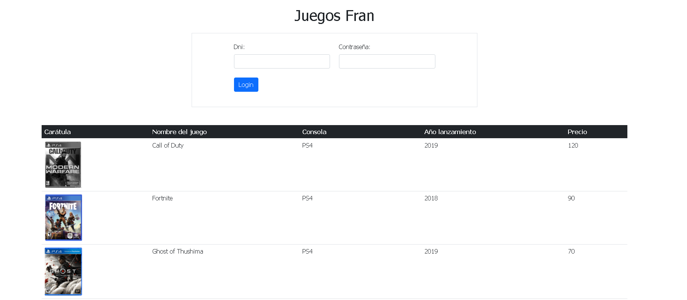

* Control de intentos de sesión restantes.

  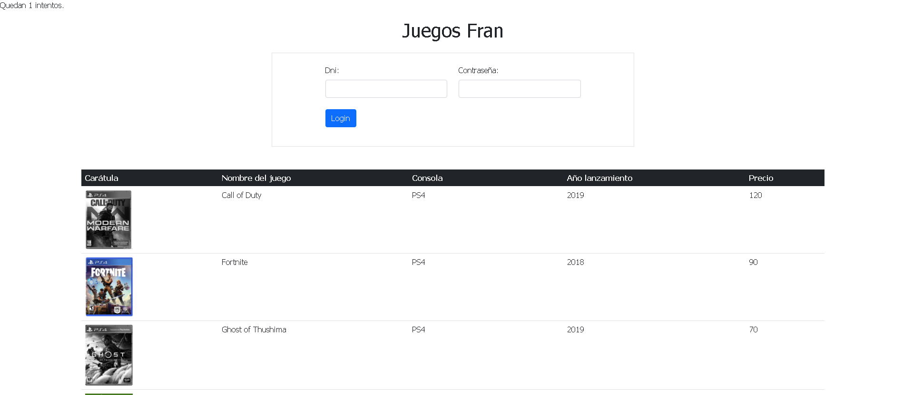

* Bloqueo de cuenta al agotarse los intentos.

  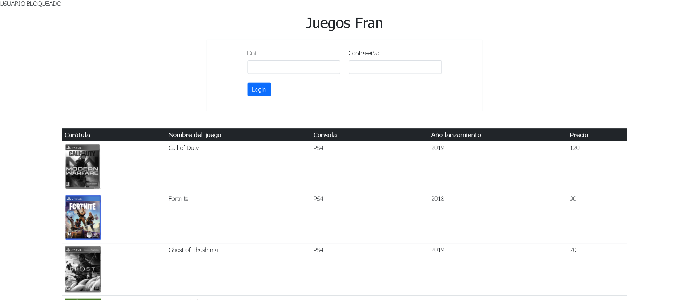

## INICIO LOGUEADO
* Página de inicio de usuario logueado, se visualizan todos los juegos, los juegos de carátula en color están disponibles para ser alquilados, los juegos con carátula en escala de grises se encuentran alquilados.

  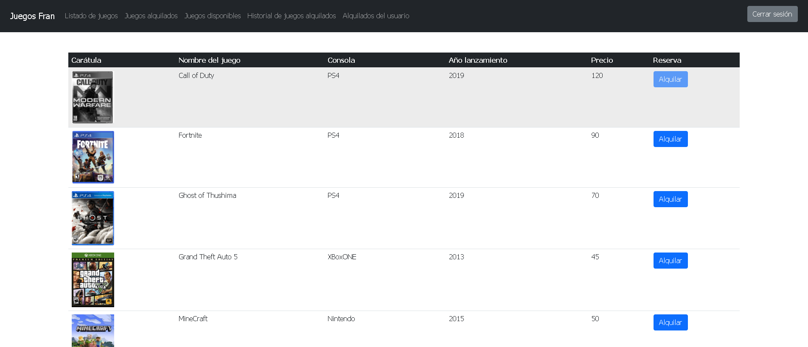

## VISTA DESCRIPCIÓN JUEGO
* Vista de la descripción y datos del juego a alquilar.

  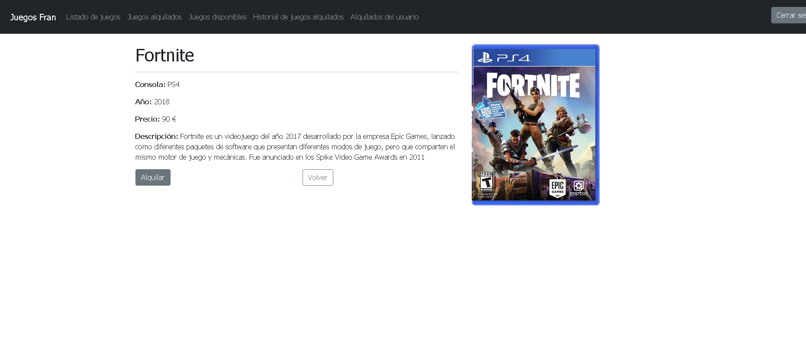

* Vista de la descripción y datos del juego alquilado.

  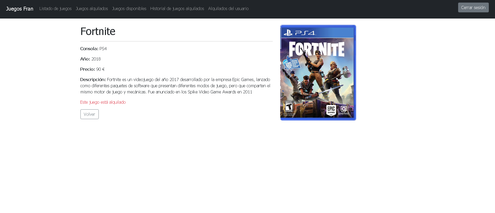

## DEVOLVER JUEGO
* Vista de los juegos alquilados por el usuario con la posibilidad de devolución.

  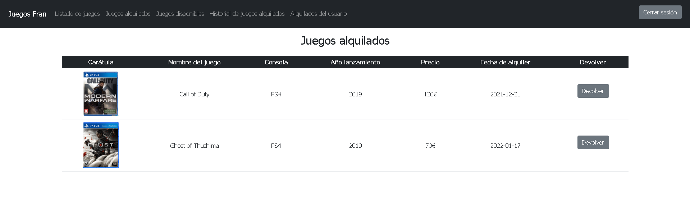

# VISTA ADMINISTRADOR
## DESBLOQUEO DE USUARIOS
* Vista desbloqueo de cuentas de usuarios por el administrador.

  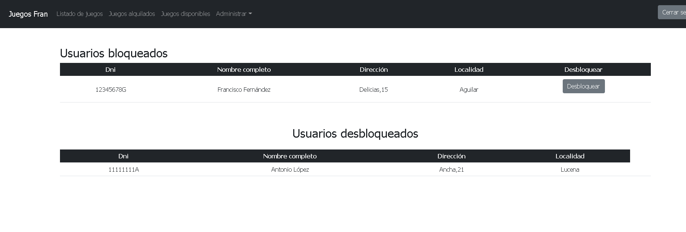

# CRUD
## AÑADIR JUEGOS
* Página con un formulario para dar de alta nuevos juegos.

  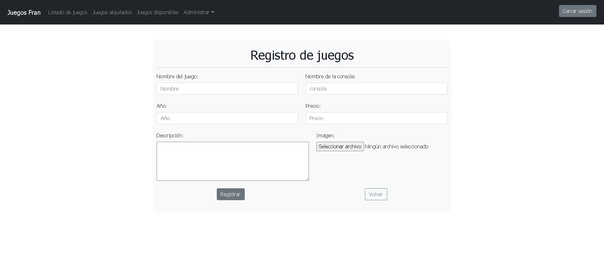

## MODIFICAR JUEGOS
* Página del administrador para modificar los juegos existentes.

  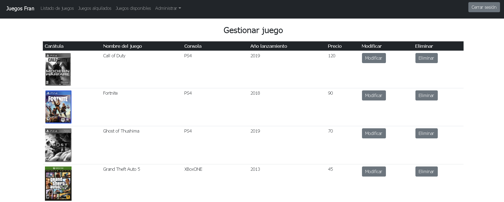

  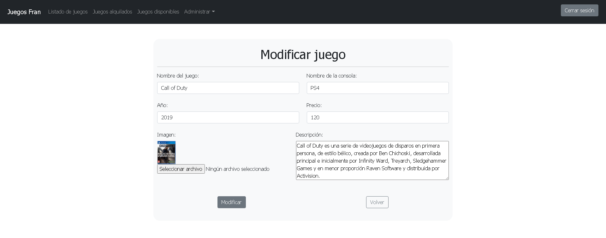

## ELIMINAR JUEGOS
* Página del administrador para dar de baja juegos.

  

